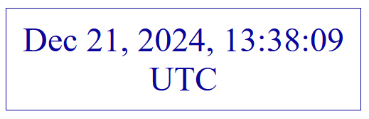
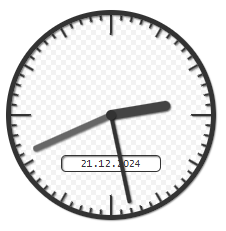

# @ixnode/simple-clock

[](https://github.com/ixnode/node-simple-clock/releases)
[](https://www.npmjs.com/package/@ixnode/simple-clock)
[](https://www.typescriptlang.org/docs/handbook/release-notes/typescript-4-9.html)
[](https://opensource.org/licenses/MIT)

A simple, customizable, and responsive clock component for React.

## 🚀 Features

* **Customizable** size and color
* **Supports** both digital and analog clocks
* Displays date, time zone and milliseconds
* **Configurable** 12-hour and 24-hour formats
* **Lightweight** and built with TypeScript
* Build on top with [storybook](https://storybook.js.org/)

## 📦 Installation

```shell
npm install @ixnode/simple-clock
```

or

```shell
yarn add @ixnode/simple-clock
```

## 🔧 Usage

### Basic Usage



```tsx
import React from 'react';
import { Clock } from '@ixnode/simple-clock';
import '@ixnode/simple-clock/dist/styles.css';

const App = () => (
    <Clock size="large" color="blue" showDate={true} showBorder={true} showTimeZone={true} />
);

export default App;
```

### More complex usage



```tsx
import React from 'react';
import { Clock } from '@ixnode/simple-clock';
import '@ixnode/simple-clock/dist/styles.css';

const App = () => (
    <Clock color={'default'} size={'small'} isAnalog={true} timeZone={"Europe/Berlin"} locale={"de-DE"} />
);

export default App;
```

## 🔧 Props

| Prop              | Type                                | Default      | Description                                 |
|-------------------|-------------------------------------|--------------|---------------------------------------------|
| `color`           | `'default'\|'red'\|'green'\|'blue'` | `'default'`  | Sets the color of the clock.                |
| `size`            | `'small'\|'medium'\|'large'`        | `'medium'`   | Sets the size of the clock.                 |  
| `showBorder`      | `boolean`                           | `false`      | Whether to show a border around the clock.  |
| `use24HourFormat` | `boolean`                           | `true`       | Use 24-hour format (true) or AM/PM (false). |
| `showTenths`      | `boolean`                           | `false`      | Show tenth of a second?                     | 
| `isAnalog`        | `boolean`                           | `false`      | Show an analog clock?                       |          
| `showDate`        | `boolean`                           | `false`      | Show date?                                  |       
| `showTimeZone`    | `boolean`                           | `false`      | Should a timezone be displayed?             | 
| `timeZoneType`    | `'short'\|'long'`                   | `'short'`    | Which type of timezone should be displayed? | 
| `locale`          | `string`                            | `'en-US'`    | Which locale should be displayed?           |  
| `timeZone`        | `string`                            | `'UTC'`      | Which time zone should be displayed?        | 

### Common locales (`locale`)

`timeZone` is used with the `Intl.DateTimeFormat` API:

| Locale  | Description                   |
|---------|-------------------------------|
| `en-US` | English (United States)       |
| `en-GB` | English (United Kingdom)      |
| `de-DE` | German (Germany)              |
| `es-ES` | Spanish (Spain)               |
| `fr-FR` | French (France)               |
| `it-IT` | Italian (Italy)               |
| `nl-NL` | Dutch (Netherlands)           |
| `pl-PL` | Polish (Poland)               |
| `pt-BR` | Portuguese (Brazil)           |
| `ru-RU` | Russian (Russia)              |
| `sv-SE` | Swedish (Sweden)              |
| `zh-CN` | Chinese (Simplified, China)   |
| `zh-TW` | Chinese (Traditional, Taiwan) |

### Common Time Zone Formats and Examples (`timeZone`)

`timeZone` is used with the `Intl.DateTimeFormat` API:

#### 1. Common Time Zone Strings (IANA-TZ Format)

These strings are based on the IANA Time Zone Database, which defines time zones used worldwide:

| Time Zone          | Description                      |
|--------------------|----------------------------------|
| `UTC`              | Coordinated Universal Time       |
| `America/New_York` | Eastern Standard Time (EST)      |
| `Europe/Berlin`    | Central European Time (CET)      |
| `Asia/Tokyo`       | Japan Standard Time (JST)        |
| `Australia/Sydney` | Australian Eastern Time (AET)    |
| `Africa/Cairo`     | East Africa Time (EAT)           |
| `Pacific/Auckland` | New Zealand Standard Time (NZST) |

#### 2. Short Time Zone Formats (Offset-based)
These formats use the offset from UTC in hours and minutes. Examples:

| Time Zone | Description            |
|-----------|------------------------|
| `GMT`     | Greenwich Mean Time    |
| `+02:00`  | Two hours ahead of UTC |
| `-05:00`  | Five hours behind UTC  |

#### 3. Abbreviated Time Zone Codes

**Note:** These are not supported by the `Intl` API and are not standardized. However, many abbreviations are commonly used in practice, such as:

| Abbreviation | Description                     |
|--------------|---------------------------------|
| `PST`        | Pacific Standard Time (UTC-8)   |
| `CET`        | Central European Time (UTC+1)   |
| `IST`        | Indian Standard Time (UTC+5:30) |

## 🛠 Development

### Building the Project

To build the project locally:

```shell
yarn build
```

### Running Storybook

View and develop components in isolation:

```shell
yarn storybook
```

Open: http://localhost:6006/

## 📦 Publishing to npm

### Build the project

```shell
yarn build
```

### Verify the build

```shell
node dist/index.js
```

### Bump the version

Update the version in the package.json, e.g., from 1.0.0 to 1.0.1, to create a new release:

```shell
npm version patch
```

Alternatively:

* Use `npm version minor` for new features.
* Use `npm version major` for breaking changes.

### Publish the package

```shell
npm publish --access public
```

### Verify the publication

Check the package on npm: [https://www.npmjs.com/package/@ixnode/simple-clock](https://www.npmjs.com/package/@ixnode/simple-clock).

## 📄 License

This project is licensed under the MIT License. See the [LICENSE](LICENSE.md) file for details.

### Authors

* Björn Hempel <bjoern@hempel.li> - _Initial work_ - [https://github.com/bjoern-hempel](https://github.com/bjoern-hempel)

## 🌟 Contributing

Contributions are welcome! Feel free to submit issues or pull requests to improve this project.

## 🤝 Acknowledgments

Special thanks to the open-source community for providing amazing tools like React, TypeScript, and Storybook.
